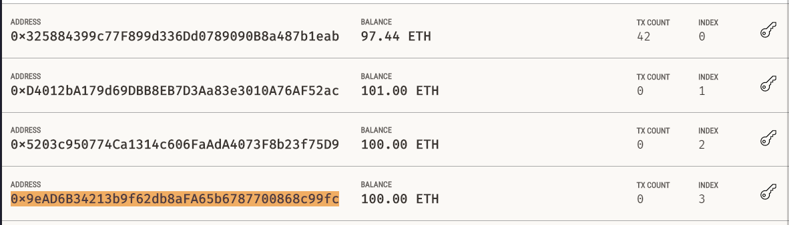
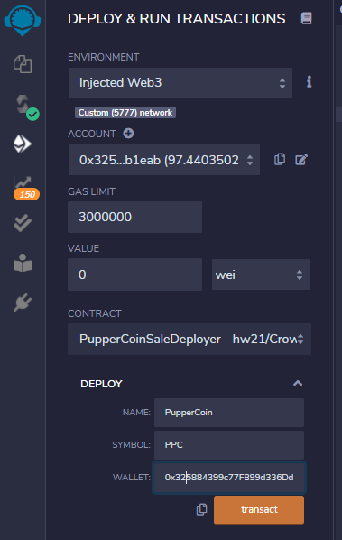
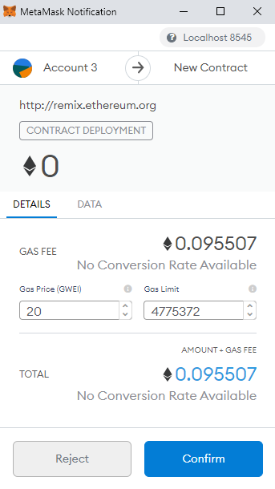

# Puppercoin Crowdsale

## Files

The following files are used to test and deploy the crowdsale:

* Puppercoin : [PupperCoin.sol](PupperCoin.sol)  
*  Crowdsale with 24 week expiry for TimedCrowdsale : [Crowdsale.sol](Crowdsale.sol)  
*  Crowdsale with 10 minute expiry for TimedCrowdSale : [Crowdsale_10min.sol](Crowdsale_10min.sol)  

The following settings were used for the Crowdsale:

* name: PupperCoin
* symbol: PPC
* initial supply : 0
* rate : 1 PupperCoin per 1 ETH
* wallet : 0x325884399c77F899d336Dd0789090B8a487b1eab
* cap : 300
* goal : 100
* openTime : now
* closeTime : now + 24 hours  (except to test expiry, which uses separate 10 min contract)

## Deploying to Ganache Local Testnet

Because we want to test to see if this contract works, we will use the 10 minute expiry version.  We will use the following addresses to fund the crowdsale:

* 0xD4012bA179d69DBB8EB7D3Aa83e3010A76AF52ac : send 50 ETH, stars with 101 ETH
* 0x5203c950774Ca1314c606FaAdA4073F8b23f75D9 : send 40 ETH, starts with 100 ETH
* 0x9eAD6B34213b9f62db8aFA65b6787700868c99fc : send 30 ETH, starts with 100 ETH

You can also see our sender account starts with 97.44 ETH (address 0x325884399c77F899d336Dd0789090B8a487b1eab).

In Remix, we deploy this contract as follows:

And we confirm in MetaMask as follows.  Note that this contract costs 0.095507 gas fees.

This puts our contract at address 0xc84B089ca2AFa668E74aB1DFca394860BC960dA8 .  With this, we have the following contract addresses:

* PupperCoinSaleDeployer : 0xc84B089ca2AFa668E74aB1DFca394860BC960dA8
* PupperCoin Token Address : 0xDC712F80316e55fE5c9047ea239d1fd6D085442B
* PupperCoin Sale Address : 0x3293f28CF13CeC79979A4BE717089Bc24cBd9384

We need the token address so we can add custom tokens to MyCrypto and check their balances.  We need the sale address to interact with the contract through Remix
